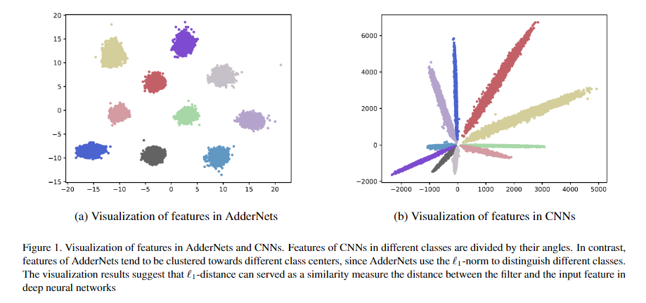
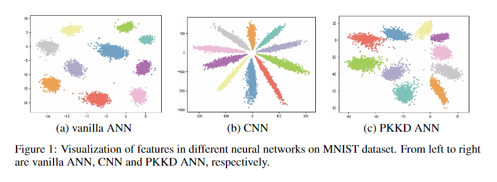

# AccANN
A compiler from AI model to RTL (Verilog) accelerator in FPGA hardware with auto design space exploration for AdderNet.

Fig 1. Visualization of features in AdderNets and CNNs. [1]
 

Fig 2. Visualization of features in different neural networks on MNIST dataset. [3]

## 🍮 Community
- Github <a href="https://github.com/Charmve/AccANN/discussions" target="_blank">discussions 💬</a> or <a href="https://github.com/Charmve/AccANN/issues" target="_blank">issues 💭</a>

- QQ Group: 697948168 (password：AccANN)
- Email: yidazhang#gmail.com 

## 🔗 Related Works

[1] AdderNet: Do We Really Need Multiplications in Deep Learning? Hanting Chen, Yunhe Wang, Chunjing Xu, Boxin Shi, Chao Xu, Qi Tian, Chang Xu. CVPR, 2020. [📑[paper](https://arxiv.org/abs/1912.13200) | [code](https://github.com/huawei-noah/AdderNet)]

[2] AdderSR: Towards Energy Efficient Image Super-Resolution. Dehua Song, Yunhe Wang, Hanting Chen, Chang Xu, Chunjing Xu, Dacheng Tao. Arxiv, 2020. [📑[paper](https://arxiv.org/abs/2009.08891) | code]

[3] ShiftAddNet: A Hardware-Inspired Deep Network. Haoran You, Xiaohan Chen, Yongan Zhang, Chaojian Li, Sicheng Li, Zihao Liu, Zhangyang Wang, Yingyan Lin. NeurIPS, 2020.

[4] Kernel Based Progressive Distillation for Adder Neural Networks. Yixing Xu, Chang Xu, Xinghao Chen, Wei Zhang, Chunjing XU, Yunhe Wang. NeurIPS, 2020. [📑[paper](https://arxiv.org/abs/2009.13044) | [code]()]

[5] GhostNet: More Features from Cheap Operations [📑[paper](https://arxiv.org/abs/1911.11907) | [code](https://github.com/huawei-noah/ghostnet)]

[6] MobileNets: Efficient Convolutional Neural Networks for Mobile Vision Applications [📑[paper](https://arxiv.org/abs/1704.04861) | [code](https://github.com/Zehaos/MobileNet)]

[7] VarGNet: Variable Group Convolutional Neural Network for Efficient Embedded Computing. Qian Zhang, Jianjun Li, Meng Yao. [📑[paper](https://arxiv.org/pdf/1907.05653v1.pdf) | [code](https://github.com/zma-c-137/VarGFaceNet)]

[8] And the bit goes down: Revisiting the quantization of neural networks (ICLR 2020). Pierre Stock, Armand Joulin, Remi Gribonval. [📑[paper](https://arxiv.org/pdf/1907.05686.pdf) | [code](https://github.com/facebookresearch/kill-the-bits)]

[9] DNNBuilder: an Automated Tool for Building High-Performance DNN Hardware Accelerators for FPGAs [📑[paper](https://docs.wixstatic.com/ugd/c50250_77e06b7f02b44eacb76c05e8fbe01e08.pdf) | [code](https://github.com/IBM/AccDNN)]

[10] AdderNet and its Minimalist Hardware Design for Energy-Efficient Artificial Intelligence. Yunhe Wang, Mingqiang Huang, Kai Han, et.al. [📑[paper](https://arxiv.org/pdf/2101.10015.pdf) |  code]

[11] Dong Wang, Ke Xu and Diankun Jiang, “PipeCNN: An OpenCL-Based Open-Source FPGA Accelerator for Convolution Neural Networks”, FPT 2017. [📑[paper](https://arxiv.org/abs/1611.02450) | [code](https://github.com/doonny/PipeCNN)]
